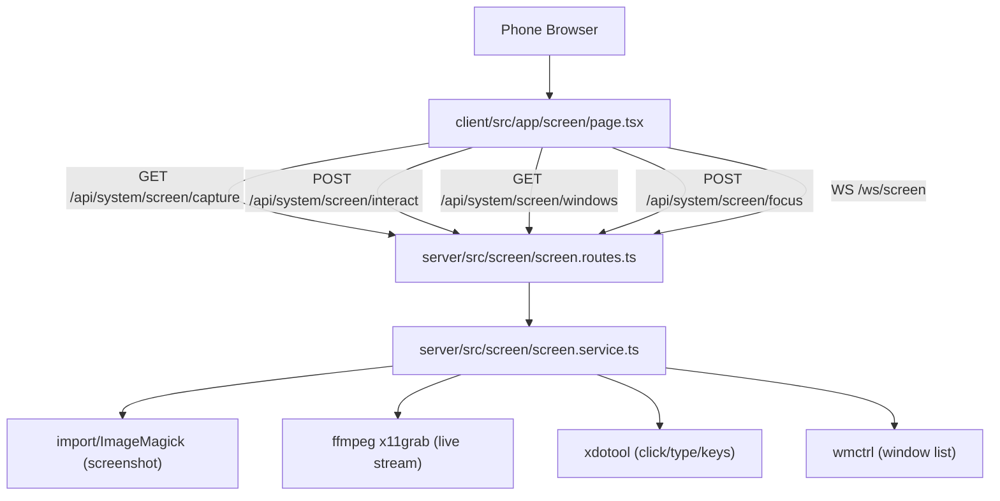

# Remote Screen View — Build Plan

## Architecture




## Files to Create

### `server/src/screen/screen.service.ts`

All shell command logic:

- `captureMonitor(monitor: 0|1)` — runs `import -window root -crop 2240x1080+{offset}+0` → returns JPEG Buffer
- `getOpenWindows()` — runs `wmctrl -l` → returns `{ id, title }[]`
- `sendClick(x, y, button?)` — `xdotool mousemove X Y click 1`
- `sendMouseMove(x, y)` — `xdotool mousemove X Y`
- `sendType(text)` — `xdotool type --clearmodifiers "text"`
- `sendKey(key)` — `xdotool key <key>`
- `focusWindow(windowId)` — `xdotool windowfocus <id>`
- `startLiveStream(monitor, onFrame, onStop)` — spawns `ffmpeg` x11grab process, parses JPEG frames from stdout, calls `onFrame(buffer)` per frame

### `server/src/screen/screen.routes.ts`

REST + WebSocket plugin (prefix `/api/system/screen`):


| Method | Path                          | Handler                                         |
| ------ | ----------------------------- | ----------------------------------------------- |
| GET    | `/capture?monitor=0`          | `captureMonitor` → reply with JPEG              |
| GET    | `/windows`                    | `getOpenWindows` → JSON                         |
| POST   | `/interact`                   | body: `{type,x?,y?,text?,key?}` → service calls |
| POST   | `/focus`                      | body: `{windowId}` → `focusWindow`              |
| WS     | `/ws/screen?monitor=0&token=` | ffmpeg stream → send base64 frames              |


### `client/src/app/screen/page.tsx`

Full page component with:

- **Top bar**: back button, monitor selector `[0][1]`, mode toggle `[Polling | Live]`
- **Main view**: `` (polling) or `<canvas>` (live), touch events translated to PC coords
- **Bottom toolbar**: `[Keyboard]` button (opens text input popup), `[Apps]` button (opens window list modal)
- **Coordinate translation**:

```typescript
  const relX = (touch.clientX - rect.left) / rect.width;
  const pcX  = Math.round(relX * MONITOR_WIDTH); // 2240
  

```

- **Polling mode**: `setInterval` every 5s → `GET /api/system/screen/capture?monitor=N` → update ``
- **Live mode**: WebSocket to `/ws/screen?monitor=N&token=...` → receive base64 JPEG → `canvas.drawImage`
- **Virtual keyboard**: text `<input>` popup → POST `/interact` `{type:'type', text}`; special keys via buttons
- **App switcher modal**: lists windows from `/windows` → tap → POST `/focus`

## Files to Modify

### `[server/src/index.ts](server/src/index.ts)`

Add two lines to register the screen plugin:

```typescript
import { screenRoutes } from './screen/screen.routes.js';
// ...
fastify.register(screenRoutes, { prefix: '/api/system/screen' });
// WebSocket (no prefix — it's /ws/screen):
fastify.register(screenWs);
```

### `[client/src/app/dashboard/page.tsx](client/src/app/dashboard/page.tsx)`

Add "Screen" link to the bottom nav bar (currently has Menu / Term / AI / Files / Config):

```tsx
<Link href="/screen" className="flex flex-col items-center space-y-1 ...">
  <MonitorIcon className="h-6 w-6" />
  <span className="text-[10px] uppercase font-bold">Screen</span>
</Link>
```

## Implementation Order

1. `screen.service.ts` — all shell helpers + ffmpeg stream
2. `screen.routes.ts` — REST endpoints + WebSocket handler
3. Register in `server/src/index.ts`
4. `client/src/app/screen/page.tsx` — polling mode + touch click first
5. Add nav item to `dashboard/page.tsx`
6. Add App Switcher modal
7. Add virtual keyboard popup
8. Add Live mode (WebSocket + canvas)
9. Add monitor switcher toggle

